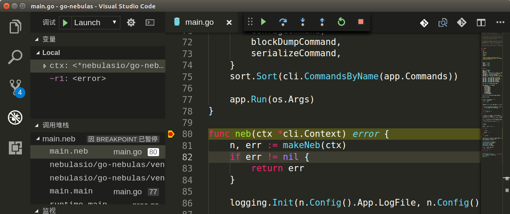

# How to debug Go-Nebulas project

作者：Wenbo Liu <aries.lwb@gmail.com>, July 17, 2017

Go-Nebulas项目地址：https://github.com/nebulasio/go-nebulas.git

## 简介

> 这篇短文基于Mac OSX 和 Ubuntu系统，简单介绍如何调试Go-Nebulas项目，主要介绍三种方法调试：dlv命令行调试，Gogland IDE调试，以及Visual Studio Code调试。

#### 调试器Delve安装

##### 在 Mac OSX 上安装Delve

Google官方为golang的调试例子用gdb，但是[delve](https://github.com/derekparker/delve/blob/master/Documentation/installation/osx/install.md)是更合适的调试器，比gdb能提供更多的信息。安装delve，在Mac上一般采用Homebrew。但是很遗憾，在本文写就时，Homebrew提供的delve包老旧，有bug，无法正确调试Go-Nebulas。普通的go项目是可以的，具体体现就是调试Go-Nebulas项目时，断点无法停住，会永远hang住。我们必须从github上下载delve的最新源代码编译成delve binary，步骤如下：

**先用Homebrew安装有bug的Delve：**

```bash
brew install go-delve/delve/delve
rm /usr/local/bin/dlv
```

安装此有问题的Delve，其实就是为了让它帮我们在Mac机器上签发一个自签名的dlv-cert证书。如果你自己愿意繁琐的手动创建证书，也可以不用安装Delve，参考https://github.com/derekparker/delve/blob/v0.12.2/Documentation/installation/osx/install.md的【Create a self-signed certificate】。
第二条rm命令是为了删除这个有问题的dlv binary，我们需要从源码编译出一个正确的版本，并且利用Homebew为我们安装的证书做codesign。
下载源代码
```bash
mkdir -p /Users/xxx/go-delve/src/github.com/derekparker
cd /Users/xxx/go-delve/src/github.com/derekparker
git clone https://github.com/derekparker/delve.git
```

创建一个临时文件夹，从github下载代码。注意文件夹中标注红色的部分，必须完全一样，这是因为go项目的源码组织规则，否则下一步编译会出错，报警package not found。其它部分请根据自己机器环境设置。

**编译**
```bash
export GOPATH=/Users/xxx/go-delve
cd /Users/xxx/go-delve/src/github.com/derekparker/delve
make install
```

应该会出现如下提示，表明编译成功：
```bash
scripts/gencert.sh || (echo "An error occurred when generating and installing a new certicate"; exit 1)
go install -ldflags="-s" github.com/derekparker/delve/cmd/dlv
codesign -s "dlv-cert"  /Users/xxx/go-delve/bin/dlv
```

然后cp /Users/liuwb/go-delve/bin/dlv/usr/local/bin/，把编译好的dlv拷贝进/usr/local/bin目录，替换之前有bug的dlv debugger。输入命令dlv version，如果能正常运行，显示版本号，说明dlv已经被加入到PATH。

##### 在 Ubuntu 上安装Delve
对于Ubuntu系统，可以直接使用下面的指令安装Delve：

```bash
go get -u github.com/derekparker/delve/cmd/dlv
```

**下载Go-Nebulas工程代码**
```bash
mkdir /Users/xxx/workspace/blockchain/src/github.com/nebulasio/
cd /Users/xxx/workspace/blockchain/src/github.com/nebulasio/
git clone https://github.com/nebulasio/go-nebulas.git
```

创建一个临时文件夹，从github下载代码。注意文件夹中标注红色的部分，必须完全一样，这是因为go项目的源码组织规则，其它部分请根据自己机器环境设置。

**Delve命令行调试**
如果你以前用gdb调试过C程序，对dlv命令行调试的风格也不会陌生。完整的dlv命令文档，参见https://github.com/derekparker/delve/blob/master/Documentation/usage/dlv.md 这里只介绍debug部分。

输入如下命令进入调试
```bash
export GOPATH=/Users/xxx/workspace/blockchain/
cd /Users/xxx/workspace/blockchain/
dlv debug github.com/nebulasio/go-nebulas/cmd/neb -- --config /Users/xxx/workspace/blockchain/src/github.com/nebulasio/go-nebulas/conf/default/config.conf
```

运行无误的话，会进入debug session：

```bash
Type 'help' for list of commands.
(dlv)
```

我们打算在neb的函数入口设置断点，输入命令

```bash
(dlv) break main.neb
Breakpoint 1 set at 0x4ba6798 for main.neb() ./src/github.com/nebulasio/go-nebulas/cmd/neb/main.go:80
(dlv)
```

dlv调试器提示代码将在cmd/neb/main.go的行号80行停住，注意这时neb程序还没有运行。输入命令continue：

```bash
(dlv) continue
> main.neb() ./src/github.com/nebulasio/go-nebulas/cmd/neb/main.go:80 (hits goroutine(1):1 total:1) (PC: 0x4ba6798)
    75:		sort.Sort(cli.CommandsByName(app.Commands))
    76:
    77:		app.Run(os.Args)
    78:	}
    79:
=>  80:	func neb(ctx *cli.Context) error {
    81:		n, err := makeNeb(ctx)
    82:		if err != nil {
    83:			return err
    84:		}
    85:
```

查看变量，可用print命令：

```bash
(dlv) print ctx
*github.com/nebulasio/go-nebulas/vendor/github.com/urfave/cli.Context {
	App: *github.com/nebulasio/go-nebulas/vendor/github.com/urfave/cli.App {
		Name: "neb",
		HelpName: "debug",
		Usage: "the go-nebulas command line interface",
		UsageText: "",
		ArgsUsage: "",
		Version: ", branch , commit ",
		Description: "",
		Commands: []github.com/nebulasio/go-nebulas/vendor/github.com/urfave/cli.Command len: 11, cap: 18, [
			(*github.com/nebulasio/go-nebulas/vendor/github.com/urfave/cli.Command)(0xc4201f4000),
			(*github.com/nebulasio/go-nebulas/vendor/github.com/urfave/cli.Command)(0xc4201f4128),
			(*github.com/nebulasio/go-nebulas/vendor/github.com/urfave/cli.Command)(0xc4201f4250),
			(*github.com/nebulasio/go-nebulas/vendor/github.com/urfave/cli.Command)(0xc4201f4378),
			(*github.com/nebulasio/go-nebulas/vendor/github.com/urfave/cli.Command)(0xc4201f44a0),
```

更多技术资料，请参考
https://github.com/derekparker/delve/tree/master/Documentation/cli
https://blog.gopheracademy.com/advent-2015/debugging-with-delve/
http://hustcat.github.io/getting-started-with-delve/


### Visual Studio Code调试

Visual Studio Code是微软公司发布的跨平台代码编辑工具，下载地址：https://code.visualstudio.com/Download
VS Code需要安装Go插件


打开文件夹/Users/xxx/workspace/blockchain/src/github.com/nebulasio/go-nebulas/，在.vscode文件夹下创建两个文件settings.json和launch.json。
settings.json文件内容：

```json
// Place your settings in this file to overwrite default and user settings.
{
    "go.gopath": "/Users/xxx/workspace/blockchain/",
    "go.formatOnSave": true,
    "go.gocodeAutoBuild": false,
    "go.toolsGopath": "/Users/xxx/workspace/gotools",
    "explorer.openEditors.visible": 0,
}
```

go.toolsGopath是analysis tools安装的地址，可以指定为任何目录，这些analysis tools可以供其它workspace共享。

launch.json文件内容：
```json
{
	"version": "0.2.0",
	"configurations": [
		{
			"name": "Launch",
			"type": "go",
			"request": "launch",
			"mode": "debug",
			"program": "${workspaceRoot}/cmd/neb",
			"env": {
				"GOPATH": "/Users/xxx/workspace/blockchain/"
			},
			"args": [
				"--config",
				"/Users/xxx/workspace/blockchain/src/github.com/nebulasio/go-nebulas/conf/default/config.conf"
			],
			"showLog": true
		}
	]
}
```

在cmd/neb/main.go，neb函数中设置断点，F5运行，Go-Nebulas项目会进行编译运行，停在断点：



> 然后，就可以开心的启动Nebulas代码调试之旅！
