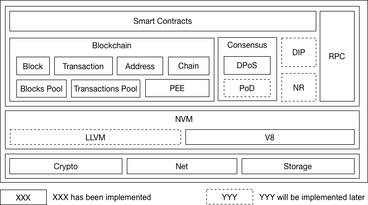

# Design Overview

> TODO: More features described in our [whitepaper](https://nebulas.io/docs/NebulasTechnicalWhitepaper.pdf), such as NR, PoD, DIP and NF, will be integrated into the framework in later versions very soon.

## Core Dataflow

Here is a core workflow example to explain how Nebulas works in current version.
For each Nebulas node, it keeps receiving blocks or transactions from network and mining new block locally.

<!-- 
@startuml workflow

group new blocks from network
    -> Net: 1. receive a new block
    Net -> BlockPool: 2. feed it
    BlockPool -> Block: 3. verify its hash
    Block -> BlockPool: 4. right
    BlockPool -> Chain: 5. search its parent
    Chain -> BlockPool: 6. found
    BlockPool -> Block: 7. verify its states
    Block -> BlockPool: 8. right
    BlockPool -> Chain: 9. link it
end

group new transactions from network
    -> Net: 10. receive a new transaction
    Net -> TxsPool: 11. feed it
    TxsPool -> Transaction: 12. verify its sign
    Transaction -> TxsPool: 13. right
    TxsPool -> TxsPool: 14. cache it
end

group new blocks minted locally
    PoW -> TxsPool: 15. prepare transactions
    TxsPool -> PoW: 16. avaliable transactions
    PoW -> PoW: 11. mining
    PoW -> Net: 11. minted
    Net ->  BlockPool: 12. feed the new block
    Net -> : 13. broadcast new block
end

@enduml
-->

## More Details

[`Blockchain`](./blockchain.md)

[`Consensus`](./consensus.md)

[`Crypto`](./crypto.md)

[`Network`](./network_protocol.md)

[`Smart Contract`](./smart_contract.md)

[`NVM`](./nvm.md)

[`RPC`](./rpc.md)

[`NR`](https://github.com/nebulasio/research/tree/master/nr)

[`PoD`](https://github.com/nebulasio/research/tree/master/pod)

DIP (TBD)