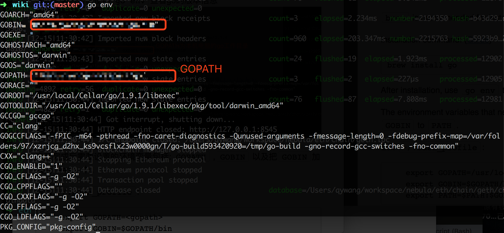
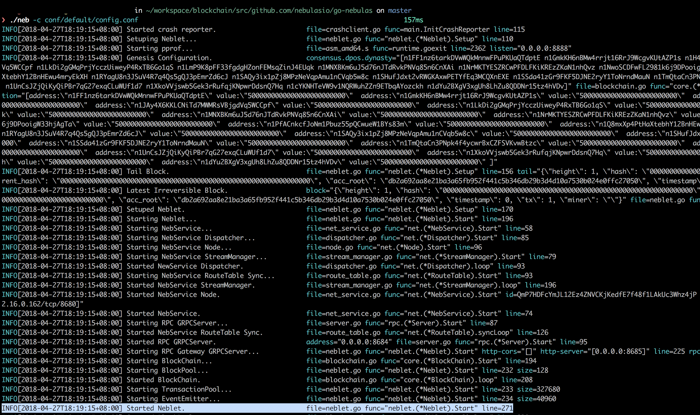

# Nebulas 101 - 01 Compile and Install Nebulas (This tutorial applies to the latest develop branch)

The project code for [Nebulas](https://nebulas.io/) has been released in several versions and tested to run locally. You can download the Nebulas source code to compile the private chain locally.

To learn about Nebulas, please read the Nebulas [Non-Technical White Paper](https://nebulas.io/docs/NebulasWhitepaper.pdf).

To learn about the technology, please read the Nebulas [Technical White Paper](https://nebulas.io/docs/NebulasTechnicalWhitepaper.pdf) and the Nebulas [github code](https://github.com/nebulasio/go-nebulas).

## Nebulas Environment Set Up

Nebulas is implemented in Go Language. Installing Go Lang is required. Go Lang version `>=1.8`.

*NVM (Nebulas Virtual Machine) uses JavaScript v8 engine. As currently v8 only run on Mac and Linux versions, Nebulas can only run on Mac and Linux at this stage. The Windows version will be coming soon.*

[Go Lang Installation](https://golang.org/doc/install)

#### Install Go Environment on Mac
`brew` is recommended for installation. To install `brew`, pleace go to [homebrew](https://brew.sh/).

Installation command: 

```
brew install go
```

After installation, use `go env` to check version for Go


## Setup project folders
first we should create a folder named "go" and place that in the documents folder. Then we should open up go folder and create another folder named src. So your project foloder should be on Mac; Users/yourUserName/Documents/go/scr/. For now just remember this location; Users/yourUserName/Documents/go  

The environment variables that need to be set after installation are: `GOPATH`,`GOBIN`. Add `GOBIN` to `PATH`.

Find you .bash_profile in Mac- Users/myUserName/.bash_profile   
If you you dont see the file you need to go to open up termial and type

```
defaults write com.apple.finder AppleShowAllFiles TRUE
```

Open up .bash_profile and copy paste this below.

Edit `~/.bash_profile`:

```
    export GOPATH=/Users/yourUserName/Documents/go
    export GOBIN=$GOPATH/bin
    export PATH=$PATH:$GOBIN
```
 **Note the export GOPATH=/Your/location/of/go (refer to Setup project folders) you must get the exact location then add it to the .bash_profile 
 
# Save the changes to your .bash_profile file.
Now restart the terminal: this is important to continue in the next step 

**Notice:GOPATH is a local go work directory and can be configured on its own. After GOPATH is configured, go project needs to be placed in GOPATH directory.**

#### Install Go Environment on Linux：
It is recommended to install Go from source. Guide: [Go Installation on Linux](https://golang.org/doc/install#install).

## Compile Nebulas

#### Download Source Code：
Clone from GitHub (This tutorial uses [v0.4.0](https://github.com/nebulasio/go-nebulas/tree/v0.4.0))

```
git clone -b v0.4.0 https://github.com/nebulasio/go-nebulas.git --depth=1
```

If you need the full commit history, clone all to local:

```
git clone https://github.com/nebulasio/go-nebulas.git
```
Since Go must compile in `$GOPATH`,  Nebulas code must be in `/src/github.com/nebulasio/go-nebulas` under `$GOPATH`。

#### Intall Go Dependencies

Nebulas' Go code dependency uses [dep](https://github.com/golang/dep). Third-party packages used in development can be downloaded using dep.

Use `brew` to install `dep`:

```
$ brew install dep
$ brew upgrade dep
```
Switch to the root directory of the project Install dependencies for Go:

```
cd <path>/go-nebulas
make dep
```
**PS: `make dep` downloads many dependencies. It would take a long time to download the first time. Some dependencies may fail to download. If you can not download, you can directly download the file generated by dep [vendor.tar.gz](http://ory7cn4fx.bkt.clouddn.com/vendor.tar.gz) and extract it to the code root directory.**
```
vendor.tar.gz
SHA1: 9292af2dcb905c92a0aff3b9052a275f513efe3c
MD5: 341144001217f72b08b97ae1ef2521f2
```

**PS: If it doesn’t work and you get an error: validateParams: could not deduce external imports' project roots
make:[dep] Error 1. 
You should use a vpn and route all information through the vpn or export proxy in the terminal: example; export http_proxy=http://127.0.0.1:1087; then try: make dep **


#### Make Build

Go to the go-nebulas folder in your terminal

```
cd location/of/your/go-nebulas
make build
```

**PS: if you get an error like: cannot find package. Step 1- export proxy to terminal $ export https_proxy=http://127.0.0.1:1087. Step 2 – make deb or dep ensure. Now you should be able to $ make build.**

Developers note: The Nebulas Go main function is in `cmd / neb / main.go`
 


Once the build is complete，you will see a generated `neb` file in go-nebulas folder, which is the root directory.


## Starting Node

#### Install V8

Nebulas's NVM (Nebulas Virtual Machine) uses JavaScript V8 engine, and the V8 dependencies for NVM need to be run with `neb` installed. The Mac version of the dynamic link library `libnebulasv8.dylib` and the Linux version of the static link library` libnebulasv8.so` and other so libraries are provided by the official V8 Dependency Library for Nebulas. A make command to install V8 dependency libraries has been added. Execute the installation command in the go-nebulas folder which is the project root directory using the terminal:

```
make deploy-v8
```

After running make deploy-v8 you should see: install nf/nvm/native-lib/*.dylib /usr/local/lib/

If you do not use make to integrate V8 link library, you can also install it separately:

* Mac
	* `install nf/nvm/native-lib/libnebulasv8.dylib /usr/local/lib/`
* Linux
	* `sudo install nf/nvm/native-lib/*.so /usr/local/lib/`
	* `sudo /sbin/ldconfig`


## Edit seed.conf

Now we need to edit the seed.conf file which is located in 
```go-nebulas/conf/default/config.conf```


Your file should look something like this:

```json
network {
  # If this is seed node, configuration is not needed. The normal node needs the seed node seed
  # seed: "UNCOMMENT_AND_SET_SEED_NODE_ADDRESS"
  # p2p network service host. support mutiple ip and ports.
  listen: ["127.0.0.1:8680"]
  # the private key is used to generate a node ID. if don't use the private key, the node will get a new ID.
  #private_key: "id_ed25519"
  # network group ID. nodes can't connect to each other in different network groups.
  network_id: 1
}

chain {
  # Network chain ID. defult: 100
  chain_id: 100
  # Database storage location
  datadir: "seed.db"
  # Node private key location
  keydir: "keydir"
  # The genesis block configuration
  genesis: "conf/default/genesis.conf"
  # Mining machine's mining address, the reward will be send to a Coinbase address
  coinbase: "eb31ad2d8a89a0ca6935c308d5425730430bc2d63f2573b8"
  # Node signature algorithm
  signature_ciphers: ["ECC_SECP256K1"]
  # Mining machine's mining address
  miner: "eb31ad2d8a89a0ca6935c308d5425730430bc2d63f2573b8"
  # The passphrase used to unlock account
  passphrase: "passphrase"
}

# Service configuration of interaction between user and node.
rpc {
    # GRPC API port
    rpc_listen: ["127.0.0.1:51510"]
    # HTTP API port
    http_listen: ["127.0.0.1:8090"]
    # The module that user can access by HTTP
    http_module: ["api","admin"]
}

# Configuration of log
app {
    # Log level {debug, info, warn, error, fatal}
    log_level: "info"
    # The output path of Log
    log_file: "logs/seed"
    # Crash log enabling
    enable_crash_report: false
}

# Other Configuration
stats {
    # Node Metrics Enabling
    enable_metrics: false
    # Configuration of influxdb
    influxdb: {
        host: "http://localhost:8086"
        db: "nebulas"
        user: "admin"
        password: "admin"
    }
}
```


#### Node

Nebulas node can be started by executing the compiled `neb` executable. Node start needs to be executed on the terminal. Neb nodes include seed nodes and nodes:

* Seed node: Nebulas network seed node, to provide initial synchronization services for other nodes;
* Node: Nebulas network normal node, synchronize routing and block information from the seed node after starting.

Nebulas seed nodes and nodes are distinguished by the configuration files. The seed node needs to be started first before the node is started. After the seed node is started, update the network address information of the seed node to the configuration file of the normal node, and then you can do mining on the network.

#### Starting Seed Node

To start Nebulas nodes, some configuration parameters are needed provided by the configuration file. The configuration file uses [Protocol Buffer](https://github.com/google/protobuf) format to read the configuration information. Project root directory has the default seed node configuration file:

`config.conf file is located in go-nebulas/conf/default/config.conf `

Seed node configuration file:

```
# Node network configuration, configurations of seed node and node distiguishes here.

network {
  # If this is seed node, configuration is not needed. The normal node needs the seed node seed
  # seed: "UNCOMMENT_AND_SET_SEED_NODE_ADDRESS"
  # p2p network service host. support mutiple ip and ports.
  listen: ["127.0.0.1:8680"]
  # the private key is used to generate a node ID. if don't use the private key, the node will get a new ID.
  #private_key: "id_ed25519"
  # network group ID. nodes can't connect to each other in different network groups.
  network_id: 1
}


```

## The final step 

The default start seed node command:

```
./neb
```

If using different configuration file, just add the `-c` flag at startup to specify the configuration file. For example, to specify a node configuration file when starting a seed node:

```
./neb -c <path>/config.conf

```
## Example neb
```
./neb conf/default/config.conf

```


Node can be started after configuration file modification. After starting, the following would be in the terminal:


#### Starting Node

After starting the seed node, if you need to start a normal node network connected with the seed node, configure the seed node address information in the normal node configuration file. The seed node address can be found from the seed node log: **node start**:

```
INFO[2017-12-25T15:04:52+08:00] node start                                    addrs="[/ip4/127.0.0.1/tcp/8680]" file=net_service.go func="p2p.(*NetService).Start" id=QmPyr4ZbDmwF1nWxymTktdzspcBFPL6X1v3Q5nT7PGNtUN line=693
```
In the log above, the address information is `/ip4/127.0.0.1/tcp/8680`,id `QmPyr4ZbDmwF1nWxymTktdzspcBFPL6X1v3Q5nT7PGNtUN `, Nebulas p2p network uses IPSF's libp2p network library. The format of the seed address:

```
<address>/ipfs/<id>
```
The configuration in the normal seed configuration file `conf/example/config.1a2635.conf`：

```
network {
  # seed: "UNCOMMENT_AND_SET_SEED_NODE_ADDRESS"
  seed: ["/ip4/127.0.0.1/tcp/8680/ipfs/QmPyr4ZbDmwF1nWxymTktdzspcBFPL6X1v3Q5nT7PGNtUN"]
  listen: ["127.0.0.1:10000"]
  network_id: 1
}
...
```
**Note: If configuring multiple nodes on the same machine, make sure to avoid port override**

When starting an normal child node, use this configuration file to start the node:

```
./neb -c conf/example/config.1a2635.conf
```

After the node starts, if the connection with the seed node is successful, you can see the following log:


