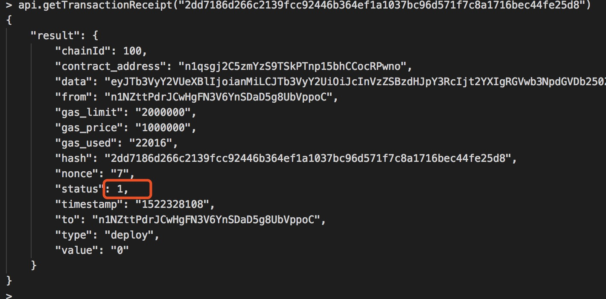
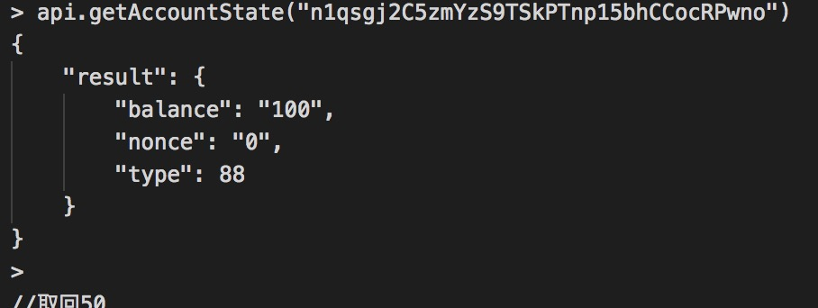
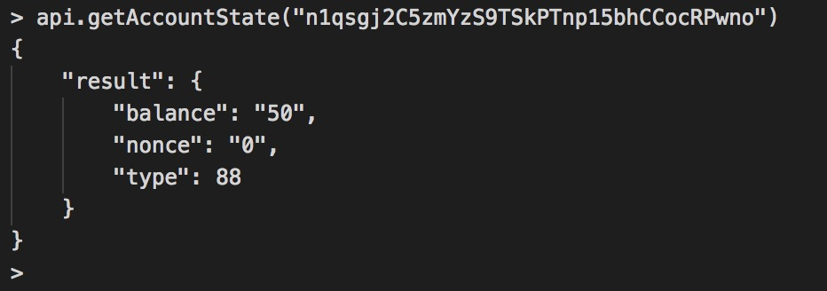

# Nebulas 101 - 03 Write and run a smart contract with JavaScript


Today we will learn how to write, deploy, and execute smart contracts in Nebulas using JavaScript

## First things first

Before making a smart contract, first we need to review the following:

1. Install, compile and start neb application
2. Create a wallet address, set coinbase, and start mining
3. Query neb node information, wallet address balance
4. Make a transfer and verify the transaction was successful

If you have doubts or don’t remember the above content, go back to the previous chapters to review. 

Now we will learn and use the smart contracts through the following steps:

1. Write a smart contract
2. Deploy the smart contract
3. Call the smart contract to verify the contract execution works


## Write a smart contract

Like Ethereum, Nebulas implements NVM virtual machines to run smart contracts and NVM implementations use the JavaScript V8 engine, so for the current development we can write smart contracts using JavaScript and even use TypeScript.

A brief description of a smart contract:

1. The smart contract code must have a Prototype object;

2. Smart contract code must have a `init ()` method, this method will only be executed once;

Devlopers note: smart contract inside the private method is _ at the beginning of the method, the private method can not be externally called directly;

Below we use JavaScript to write the first smart contract: bank vault.

This smart contract needs to fulfill the following functions:

1. The user can save money to his bank vault.
2. Users can withdraw money from his bank vault.

Smart contract example:

```js
'use strict';

var DepositeContent = function (text) {
	if (text) {
		let o = JSON.parse(text);
		this.balance = new BigNumber(o.balance);
		this.expiryHeight = new BigNumber(o.expiryHeight);
	} else {
		this.balance = new BigNumber(0);
		this.expiryHeight = new BigNumber(0);
	}
};

DepositeContent.prototype = {
	toString: function () {
		return JSON.stringify(this);
	}
};

var BankVaultContract = function () {
	LocalContractStorage.defineMapProperty(this, "bankVault", {
		parse: function (text) {
			return new DepositeContent(text);
		},
		stringify: function (o) {
			return o.toString();
		}
	});
};

// save value to contract, only after height of block, users can takeout
BankVaultContract.prototype = {
	init: function () {
		//TODO:
	},

	save: function (height) {
		var from = Blockchain.transaction.from;
		var value = Blockchain.transaction.value;
		var bk_height = new BigNumber(Blockchain.block.height);

		var orig_deposit = this.bankVault.get(from);
		if (orig_deposit) {
			value = value.plus(balance);
		}

		var deposit = new DepositeContent();
		deposit.balance = value;
		deposit.expiryHeight = bk_height.plus(height);

		this.bankVault.put(from, deposit);
	},

	takeout: function (value) {
		var from = Blockchain.transaction.from;
		var bk_height = new BigNumber(Blockchain.block.height);
		var amount = new BigNumber(value);

		var deposit = this.bankVault.get(from);
		if (!deposit) {
			throw new Error("No deposit before.");
		}

		if (bk_height.lt(deposit.expiryHeight)) {
			throw new Error("Can't takeout before expiryHeight.");
		}

		if (amount.gt(deposit.balance)) {
			throw new Error("Insufficient balance.");
		}

		var result = Blockchain.transfer(from, amount);
		if (result != 0) {
			throw new Error("transfer failed.");
		}
        Event.Trigger("BankVault", {
            Transfer: {
                from: Blockchain.transaction.to,
                to: from,
                value: amount.toString(),
            }
        });

		deposit.balance = deposit.balance.sub(amount);
		this.bankVault.put(from, deposit);
	}
};

module.exports = BankVaultContract;
```

As you can see from the smart contract example above, `BankVaultContract` is a prototype object that has an `init ()` method that satisfies what we call the most basic description for writing smart contracts.

BankVaultContract implements two other methods:
- `save ()`: The user can save money to the bank vault by calling the `save ()` function;
- `takeout ()`: Users can withdraw money from bank vault by calling `takeout ()` function;

The contract code above uses the built-in `Blockchain` object and the built-in` BigNumber () `function.

## So now let's break down the smart contract code line by line:


```js

	// Put the amount into the safe 
	save: function (height) {
	    // Get the address of the current invocation contract 
		var from = Blockchain.transaction.from;
		 // Get the current transaction value (value is Bignumber object) amount transferred to the contract address, safe deposit 	
		var value = Blockchain.transaction.value;
		// current block height 	
		var bk_height = new BigNumber(Blockchain.block.height);
		
		// Get deposit information 
		var orig_deposit = this.bankVault.get(from);
		if (orig_deposit) {
			value = value.plus(balance);
		}
		
		// Update deposit information
		var deposit = new DepositeContent();
		deposit.balance = value;
		deposit.expiryHeight = bk_height.plus(height);

		this.bankVault.put(from, deposit);
	},
```

`takeout ():`

```js
//  removed from the safe deposit
	takeout: function (value) {
		//  depositor address 
		var from = Blockchain.transaction.from;
		// current block height 
		var bk_height = new BigNumber(Blockchain.block.height);
		//teller Amount 
		var amount = new BigNumber(value);
		
		// Deposit information
		var deposit = this.bankVault.get(from);
		if (!deposit) {
			throw new Error("No deposit before.");
		}

		if (bk_height.lt(deposit.expiryHeight)) {
			throw new Error("Can't takeout before expiryHeight.");
		}

		if (amount.gt(deposit.balance)) {
			throw new Error("Insufficient balance.");
		}

		// Call blockchain's transfer interface to make the amount to be waived to the user's wallet address 
		var result = Blockchain.transfer(from, amount);
		if (result != 0) {
			throw new Error("transfer failed.");
		}
		
		// Add transfer event listener 
        Event.Trigger("BankVault", {
            Transfer: {
                from: Blockchain.transaction.to,
                to: from,
                value: amount.toString(),
            }
        });
        
        // update information Deposit 
		deposit.balance = deposit.balance.sub(amount);
		this.bankVault.put(from, deposit);
	}
```

## Deploy smart contracts
Now we need to deploy the smart contract to the chain.

Earlier, I introduced how users made a transaction in Nebulas, and we used the `sendTransation ()` interface to initiate a transaction. Deploying a smart contract in Nebulas is actually just sending a transaction, just with different parameters.

```js
sendTransation(from, to, value, nonce, gasPrice, gasLimit, contract)
```
If “FROM” and “TO” are the same address, that means your deploying a smart contract.

- value: when deploying contract `"0"`;

- gasPrice: The gasPrice used to deploy the smart contract, which can be `GetGasPrice` used by default, or by using an empty string.

- gasLimit: gasLimit [`EstimateGas`](https://github.com/nebulasio/wiki/blob/master/rpc.md#estimateGas)
 to deploy the contract, can not use the default value through the gas consumption that can get the deployment contract, or set a larger value, which is calculated based on the actual usage.

- contract: contract information, the parameters passed in when the contract is deployed
    - `source`: Contract code
    - `sourceType`: Contract code type, support `js` and `ts` (corresponding javaScript and typeScript code)
    - `args`: Contract initialization method parameters, no parameters for the empty string, a parameter for the JSON array

Detailed interface documentation [API](https://github.com/nebulasio/wiki/blob/master/rpc.md#sendtransaction)


#### Example of deploying a smart contract using curl:
Note: if you get error: 500 Internal Privoxy Error, open up a new terminal and type: `unset https_proxy`

```js
// Request
curl -i -H 'Accept: application/json' -X POST http://localhost:8685/v1/user/transaction -H 'Content-Type: application/json' -d '{"from":"1a263547d167c74cf4b8f9166cfa244de0481c514a45aa2c","to":"1a263547d167c74cf4b8f9166cfa244de0481c514a45aa2c", "value":"0","nonce":2,"gasPrice":"1000000","gasLimit":"2000000","contract":{
"source":"\"use strict\";var BankVaultContract=function(){LocalContractStorage.defineMapProperty(this,\"bankVault\")};BankVaultContract.prototype={init:function(){},save:function(height){var deposit=this.bankVault.get(Blockchain.transaction.from);var value=new BigNumber(Blockchain.transaction.value);if(deposit!=null&&deposit.balance.length>0){var balance=new BigNumber(deposit.balance);value=value.plus(balance)}var content={balance:value.toString(),height:Blockchain.block.height+height};this.bankVault.put(Blockchain.transaction.from,content)},takeout:function(amount){var deposit=this.bankVault.get(Blockchain.transaction.from);if(deposit==null){return 0}if(Blockchain.block.height<deposit.height){return 0}var balance=new BigNumber(deposit.balance);var value=new BigNumber(amount);if(balance.lessThan(value)){return 0}var result=Blockchain.transfer(Blockchain.transaction.from,value);if(result>0){deposit.balance=balance.dividedBy(value).toString();this.bankVault.put(Blockchain.transaction.from,deposit)}return result}};module.exports=BankVaultContract;","sourceType":"js", "args":""}}'

// Result
{
    "txhash":"3a69e23903a74a3a56dfc2bfbae1ed51f69debd487e2a8dea58ae9506f572f73",
    "contract_address":"4702b597eebb7a368ac4adbb388e5084b508af582dadde47"
}
```

The return value for deploying a smart contract is the transaction's hash address `txhash` and the contract's address` contract_address` .
Getting the return value does not guarantee a successful deployment of the contract, because `sendTransaction ()` is an asynchronous process, needed to be packaged by the miner. As the previous transaction, the transfer does not arrive in real time because it is dependent on the miner's packing speed, so you need to wait for a period of Time (about 1 minute) after which you can verify the contract is deployed successfully by calling the contract address or calling the smart contract.

## Verify if the deployment of the contract was successful
We get the contract address `contract_address` when deploying the smart contract, and we can easily check the contract's address information using the console to verify whether the contract has been deployed successfully.

As shown above, if we can get the contract information by the address of the contract, it means the contract has been deployed successfully.

## call smart contract
The way to call a smart contract in Nebulas is also very simple, you can call the smart contract through the rpc interface `call ()` function.

```js
call(from, to, value, nonce, gasPrice, gasLimit, contract)
```
- from: user wallet address
- to: smart contract address
- value: The amount of money used to transfer a smart contract
- nonce: user transaction ID, the order of growth
- gasPrice: The gasPrice used to deploy the smart contract, which can be `GetGasPrice` used by default, or by using an empty string.
- gasLimit: gasLimit [`EstimateGas`](https://github.com/nebulasio/wiki/blob/master/rpc.md#estimateGas) to deploy the contract, can not use the default value through the gas consumption that can get the deployment contract, or set a larger value, which is calculated based on the actual usage.
- contract: contract information, the parameters passed in when the contract is deployed
    function: Call contract method
    args: Contract initialization method parameters, no parameters for the empty string, a parameter for the JSON array
Call smart contract `save ()` method:

```js
// Request
curl -i -H 'Accept: application/json' -X POST http://localhost:8685/v1/user/call -H 'Content-Type: application/json' -d '{"from":"1a263547d167c74cf4b8f9166cfa244de0481c514a45aa2c","to":"333cb3ed8c417971845382ede3cf67a0a96270c05fe2f700","value":"100","nonce":3,"gasPrice":"1000000","gasLimit":"2000000","contract":{"function":"save","args":"[0]"}}'

// Result
{
   "txhash": "cab27f9653cd8f3232d68fc8123d85ea508181a545b22d6eefd1f394dee7d053"
}
```
The essence of a smart contract call is to submit a transaction, it depends on the miners to package the transaction, the miners will be successful after the transaction package call is considered successful, so the call to the smart contract is not immediately effective. We need to wait (about a minute) and than we can verify that our call was successful.
Above we call the `save ()` function to the bank vault to deposit the amount of $100, you also need to deduct $100 from the user's balance, so there is a transfer process, the amount of the transfer needs to pass the value field. After the contract is invoked, you only need to verify that the smart contract's address balance is $100.
By using console, we can easily check the current smart contract address amount:


Call the smart contract `takeout ()` function:

```js
// Request
curl -i -H 'Accept: application/json' -X POST http://localhost:8685/v1/user/call -H 'Content-Type: application/json' -d '{"from":"1a263547d167c74cf4b8f9166cfa244de0481c514a45aa2c","to":"333cb3ed8c417971845382ede3cf67a0a96270c05fe2f700","value":"0","nonce":4,"gasPrice":"1000000","gasLimit":"2000000","contract":{"function":"takeout","args":"[50]"}}'

// Result
{
   "txhash": "cab27f9653cd8f3232d68fc8123d85ea508181a545b22d6eefd1f394dee7d053"
}
```
The above `takeout ()` function is different from the `save ()` function except that the value of 50 is taken out of the vault, and the amount withdrawn to the user is an operation inside the smart contract, so the value parameter does not need to have a value and the amount withdrawn is the operation of the Smart contract related parameters, so they are passed through args parameters.
Then we need to verify that the current smart contract address balance is not $50:


The picture above shows that the smart contract call result is correct, and the smart contract deployment to the call is successful.

